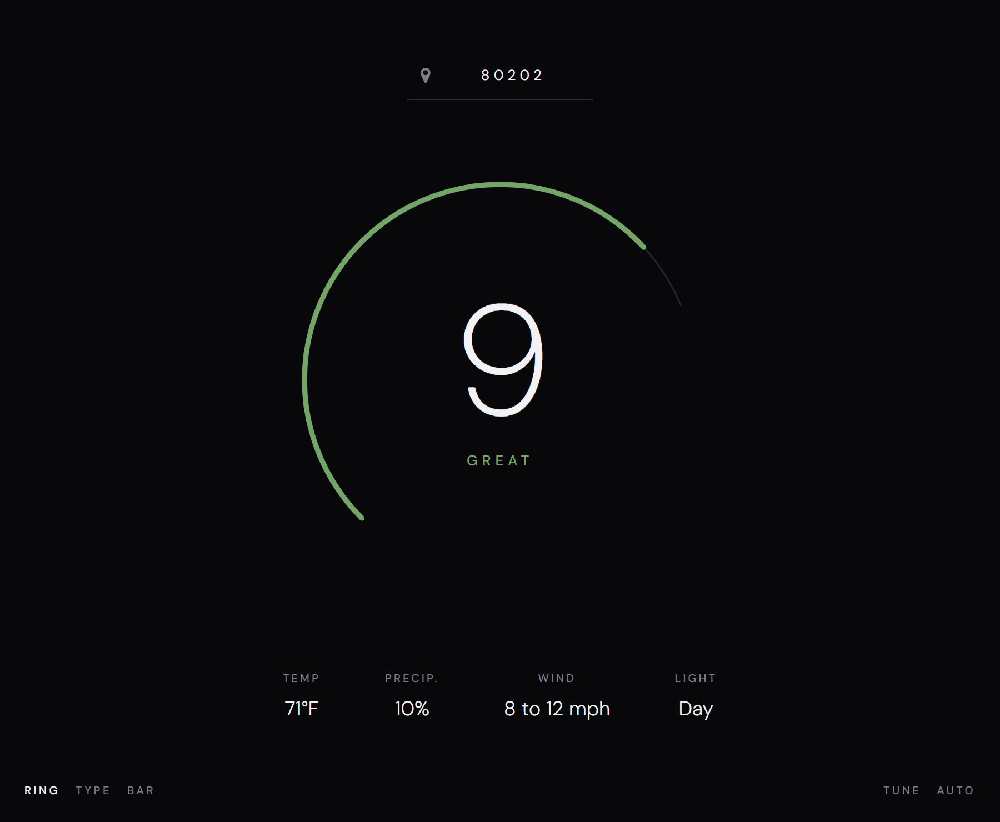
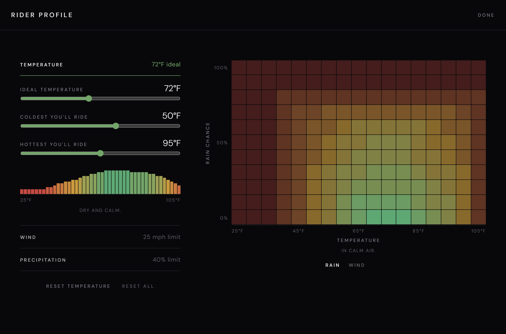
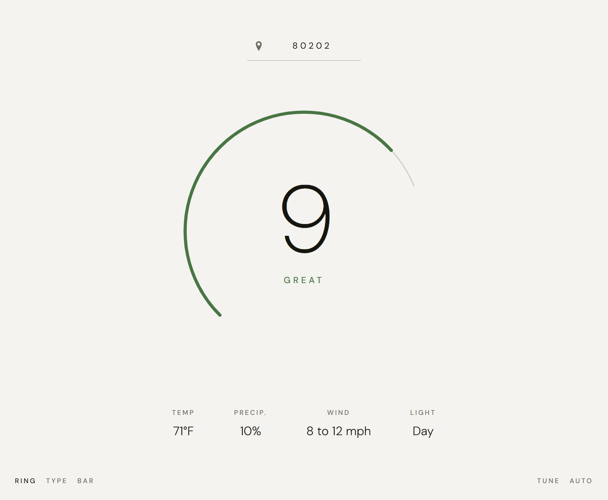
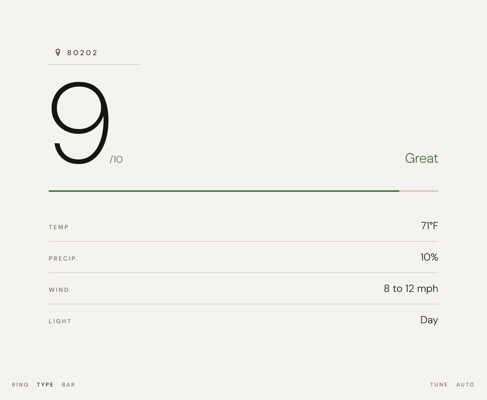
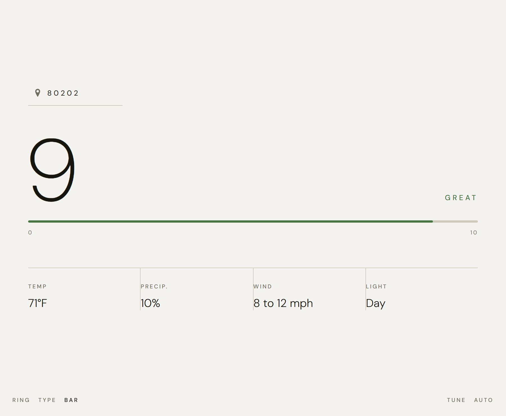

# RideFactor

**Is it a good day to ride?** RideFactor answers with a score out of ten, calculated from the live weather forecast against a profile that you can personally tune.

Live at **[ridefactor.app](https://ridefactor.app)** and
**[shouldiride.today](https://shouldiride.today)**.

Statically served with a few ES modules and a stylesheet.

<p align="center">
  
</p>

---

## Why a score instead of a forecast

A forecast will tell you it will be 48°F with a 35% chance of rain and gusts to 30.
Whether that counts as a ride is up to you. RideFactor does the math that you would otherwise do in your head.

Two rules do most of the work:

- **It reports the worst of the next three hours.**
- **Hazards cap the score.** A perfect temperature
  won't redeem a 60 mph crosswind.

## How the score is built

Scoring happens in two passes, in [`scripts/scoring.js`](scripts/scoring.js).

**1. How pleasant it would be.** A weighted sum of three sub-scores:

| Factor | Weight | Curve |
| --- | --- | --- |
| Temperature | 40% | A Gaussian centered on your ideal. |
| Precipitation | 40% | `(1 - chance)^2` |
| Wind | 20% | A squared falloff toward 40 mph. |

**2. How good it's allowed to be.** Each hazard contributes a ceiling which are linear ramps that only hit zero some way past
the limits you set, so your stated limit reads as "marginal" instead of
"impossible". The coldest temperature you say you'll ride scores about a 4 or 5.

The two passes combine as `min(pleasantness, ceiling)`, scaled by `0.9` after
dark, then rounded to the nearest whole number.

Each score gets a label:

| Score | 0 | 1–2 | 3–5 | 6 | 7 | 8–9 | 10 |
| --- | --- | --- | --- | --- | --- | --- | --- |
| **Label** | Terrible! | Poor | OK | Better | Good | Great | Perfect! |

## Tuning the rider profile

Five sliders behind the **Tune** button. They're stored in your browser local storage.

<p align="center">
  
</p>

| Setting | Range | What it moves |
| --- | --- | --- |
| Ideal temperature | 55–95°F | The center of the temperature curve |
| Coldest you'll ride | 20–70°F | Where the cold ceiling starts |
| Hottest you'll ride | 75–115°F | Where the heat ceiling starts |
| Wind you're OK with | 5–45 mph | Where the wind ceiling starts |
| Rain chance you're OK with | 0–90% | Where the rain ceiling starts |


## Layouts and themes

The same forecast with three themes/layouts. All settings are non-volatile.

| Ring | Type | Bar |
| :---: | :---: | :---: |
|  |  |  |
| A sweeping arc that thickens as well as lengthens with the score | The number at display size, with the readouts as a list | A horizontal meter with the readouts in columns |

The accent color is interpolated along a bad → mid → good ramp.

## Running it

Any static server will do.

```sh
python -m http.server 8000
# or
npx serve .
```

Then open <http://localhost:8000>.

## Where the data comes from

| Service | Used for |
| --- | --- |
| [api.weather.gov](https://www.weather.gov/documentation/services-web-api) | The hourly forecast (no key required) |
| [Nominatim](https://nominatim.org/) | Postal code to coordinates and back |
| [ipinfo.io](https://ipinfo.io/) | Approximate location, only when GPS and postal code is unavailable or denied |

Location is resolved in order of preference: a postal code input, then
browser GPS, then the IP fallback.

**RideFactor is US-only.** The National Weather Service covers the United
States, and geocoding is limited to US postal codes to match.

### Caching and privacy

Geocoding results and NWS grid mappings don't change, so both are cached in `localStorage` under a versioned prefix.

Everything is in your browser except the location lookups above. The rider profile,
layout, theme and chart axis live in `localStorage` under `ridefactor.*` keys.

## Project layout

```
index.html            Markup for the score panel, the tuning screen and the controls
styles/index.css      Everything visual
scripts/
  index.js            Fetch, score, render
  weather.js          Location resolution, the forecast fetch, and the lookup cache
  scoring.js          Curves, ceilings, weights
  rating.js           Worst of the next few hours and labels
  profile.js          The tunable fields, their bounds, and clamping
  render.js           Paints a result and controls the animation
  settings.js         The rider profile screen
  charts.js           Bar and grid chart primitives for that screen
  color.js            The score to color ramp
  controls.js         Layout and theme switching
  dom.js              Element references, as singletons
  preferences.js      localStorage reads and writes
```

## License

[Apache 2.0](LICENSE).
